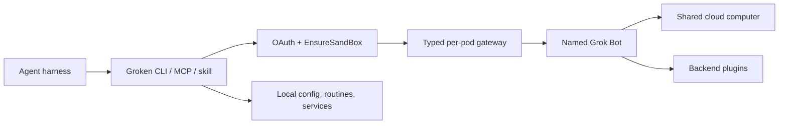

# groken

<p align="center"></p>

<p align="center"><strong>Use persistent Grok Bot cloud computers from your terminal or AI-agent harness.</strong></p>

Groken is a macOS client for the official Grok Bot desktop app. It gives CLI,
MCP, and skill-based agents typed access to named Bots, their cloud computers,
transcripts, plugins, teams, and shared rooms while keeping account credentials
on your machine.

- **Protocol-faithful:** OAuth PKCE, `EnsureSandBox`, typed gateway commands,
  and SSE events follow the official app contract.
- **Harness-ready:** install MCP or `SKILL.md` integration for Claude, Codex,
  Cursor, OpenCode, omo/senpi, Hermes, and other supported agents.
- **Operational:** chat, VNC, native execution, Bot updates, environment
  capture/restore, routines, teams, swarms, and revocable sharing.
- **Fail-closed:** unknown app drift, unsafe generic gateway dispatch, and
  unconfirmed mutations are not silently accepted.

> Groken requires a legitimate Grok Bot account.

## Requirements

- macOS
- Python 3.11 or newer
- [`uv`](https://docs.astral.sh/uv/)
- the official Grok Bot app and an account permitted to use it
- GitHub repository access while Groken remains private

## Quick start

```bash
git clone git@github.com:trac3r00/groken.git
cd groken
uv tool install --editable ".[mcp,share,worker]"

groken login
groken doctor
groken ask "Inspect the project and report the top three risks"
```

`groken login` opens the browser and stores tokens at
`~/.config/groken/tokens.json` with owner-only permissions. First use creates a
Bot named `groken` when necessary. To use an existing Bot instead:

```bash
groken list
groken configure NAME
groken ask "Summarize the current work"
```

Run `groken guide` at any time to print the first-run workflow again.

## Connect an agent harness

```bash
groken install                 # interactively select detected harnesses
groken install --all           # install into every detected harness
groken install codex cursor    # install only named targets
groken install --dry-run       # preview changes
groken uninstall --all         # remove supported integrations
```

Installation preserves sibling configuration, is idempotent, and creates a
`.groken-bak` backup before changing a harness config. Restart the harness after
installation so it reloads the MCP server or skill.

| Target | Integration |
| --- | --- |
| `claude-code`, `claude-desktop` | MCP |
| `claude-skills` | `SKILL.md` |
| `codex`, `cursor`, `vscode`, `gemini-cli` | MCP |
| `codex-skills`, `cursor-skills` | `SKILL.md` |
| `opencode`, `windsurf`, `kiro`, `hermes` | MCP |
| `gjc`, `gjc-skills` | MCP or `SKILL.md` |
| `omo`, `omo-skill` | omo/senpi skill |
| `openclaw` | detected only; config schema is not yet written |

## Everyday commands

### Chat and computer access

```bash
groken ask "task" [BOT]         # send and wait for the reply
groken ask "task" --stream      # stream reply chunks in a TTY
groken send "task" [BOT]        # fire-and-forget
groken tail [BOT] -n 50 --json  # inspect recent transcript entries
groken connect [BOT]            # open the Bot computer in a browser
groken status --json            # Bot, host, secrets, MCP, and local health
groken doctor                   # run the complete diagnostic ladder
```

Task text is sent unchanged. Groken adds no local refusal filter or jailbreak
rewrite. The dedicated Bot does carry standing instructions to verify results,
avoid silent destructive changes, and report blockers instead of looping.

All Bots on one account share cloud files, browser sessions, and logins. Their
conversations and displays remain individually addressable.

### Bot lifecycle and environment

```bash
groken bot add NAME
groken bot duplicate SOURCE NEW
groken bot update [BOT]
groken bot env capture [BOT]
groken bot env restore [BOT]
```

Updates are manual. Environment capture records package and application
inventory before an update; restore is diff-based, confirm-first, resumable,
and does not bypass macOS security prompts. Groken intentionally provides no
Bot deletion command.

### Plugins and routines

```bash
groken tools list [SERVER...]
groken tools call SERVER TOOL --args-json '{}' --yes

groken routine list
groken routine new NAME
groken routine edit NAME
groken routine run NAME --event manual
```

Plugin credentials remain in the Grok Bot backend. Calls require an interactive
confirmation or explicit `--yes`. Local routines live under
`~/.config/groken/routines/` and support `manual`, `pre-update`, `post-update`,
and `env-restore` events; they are not a scheduler.

### Native teams and swarms

A native team is one persistent Grok Bot group with two to six existing Bots:

```bash
groken team create delivery --bots researcher,coder,reviewer --description "Ship reviewed changes"
groken team members delivery
groken team ask delivery "Implement and review the release"
```

A swarm is an external fan-out from Groken. Results stay in requested Bot order,
and partial failures do not discard successful answers:

```bash
groken swarm send --bots alice,bob "Compare the two designs"
groken swarm send --bots alice,bob,carol --rounds 2 "Agree on one design"
groken swarm rooms
```

`--rounds` accepts 1–3 rounds and relays peer answers between rounds. There is no
background swarm service.

## Share one Bot

An owner can issue a revocable token pinned to one immutable Bot id without
copying OAuth or refresh credentials to the recipient.

Owner:

```bash
groken share create --name bob --bot research-bot
groken share serve                 # foreground, 127.0.0.1:8787 by default
groken share list
groken share revoke bob
```

Recipient:

```bash
chmod 600 token.txt
groken share connect https://relay.example.com --token-file token.txt
groken ask "Start the task"
groken tail
groken exec "pwd"
groken vnc
groken share disconnect
```

The token is displayed once and stored only as a hash by the owner. Plain HTTP
is accepted only on loopback. Put the relay behind HTTPS, disable proxy
buffering for event streams, and treat VNC URLs as secrets.

A share controls account access, not VM isolation: Bots on the same account
still share their cloud computer. Review the security model below before
exposing a relay.

## Native operations and remote workers

Groken includes two advanced operation planes in addition to normal Bot chat:

1. **Native operation plane** — typed remote exec, shell, file, process, and VNC
   operations through a local controller. Start with `groken exec`, `groken vnc`,
   or `groken-native --help`, then read
   [`docs/native-operation-plane.md`](docs/native-operation-plane.md).
2. **Remote OMO worker plane** — durable task submission, leases, callbacks,
   polling, and idempotent completion for a remote OMO process. It does not
   expose a generic shell endpoint. See
   [`docs/direct-worker-runbook.md`](docs/direct-worker-runbook.md).

Install and inspect local services with:

```bash
groken service install
groken service status
groken service uninstall
```

These services are optional. Bind controllers and relays to loopback and expose
them only through a private or authenticated HTTPS tunnel.

## MCP server

`groken install` writes the right configuration for supported hosts. Manual
launches use the same typed tool set on every transport:

```bash
groken-mcp                                  # stdio
groken-mcp --transport http --port 8321     # streamable HTTP
groken-mcp --transport sse --port 8322      # legacy SSE
```

Main tools include:

- `grok_bot_ask`, `grok_bot_send`, `grok_bot_list`, `grok_bot_tail`
- `grok_bot_status`, `grok_bot_capabilities`
- `grok_bot_add`, `grok_bot_duplicate`, `grok_bot_update_*`
- `grok_env_capture`, `grok_env_restore`
- `grok_plugin_list`, `grok_plugin_call`
- `grok_routine_list`, `grok_routine_run`
- `grok_team_create`, `grok_team_members`, `grok_team_ask`
- `grok_swarm_send`

Mutating MCP operations require the exact reviewed call to include
`confirmed=true`.

## Architecture



The client calls `aiserver.v1.GrokBotService/EnsureSandBox` over Connect-RPC,
then uses the returned per-pod gateway token and network token for typed
`POST /api/<command>` operations and `/events` SSE. Gateway failures trigger one
fresh sandbox mint and one retry; prompt nonces preserve send idempotency.

Groken does not expose the gateway as arbitrary `method + args` automation.
Risky operations receive explicit typed adapters, confirmation boundaries, and
focused tests.

## App compatibility

The current audited profile matches the installed Grok Bot 0.30.0 app:

- 147 gateway commands
- exact app ASAR and coordinator hashes
- six critical handler/validator fingerprints
- fail-closed detection for unknown hashes, command drift, or fingerprint drift
- 0.24 and 0.27 historical profiles retained for comparison

```bash
groken capabilities
groken inspect-app
groken inspect-app --fail-on-drift
```

Command names and critical fingerprints are verified. Request/reply schema
coverage is intentionally marked partial where the app has not supplied enough
runtime evidence; those operations remain inventory-only rather than being
guessed. Full details:
[`docs/capabilities-0.30.0.md`](docs/capabilities-0.30.0.md).

## Security model

- Tokens, Bot binding, grants, and worker state use owner-only local files.
- Groken never sends local credentials through Bot chat.
- Password, 2FA, CAPTCHA, and macOS security prompts require human takeover.
- Plugin calls and other mutations require explicit confirmation.
- HTTP/SSE MCP transports have no built-in authentication; keep them on
  loopback or place them behind an authenticated proxy.
- Native execution is remote execution, not an OS sandbox; review the command,
  working directory, and timeout.
- A transport failure during a non-idempotent mutation can leave an unknown
  outcome. Inspect state before retrying.
- Groken does not patch the official app or bypass account, provider, plugin,
  or human-confirmation controls.

## Troubleshooting

| Symptom | First action |
| --- | --- |
| Sign-in or token error | `groken login`, then `groken doctor` |
| Gateway unavailable | run `groken doctor`; retry after sandbox recovery |
| App update changed commands | `groken inspect-app --fail-on-drift` |
| Harness cannot see tools | re-run `groken install TARGET`, then restart it |
| Bot computer does not open | retry `groken connect`; override display only when known |
| Restore needs manual work | complete prompts, then run `groken bot env restore --retry-manual` |
| Need the first-run commands | `groken guide` |

`groken doctor` continues through diagnostic tiers so one failure does not hide
later evidence.

## Uninstall

```bash
groken uninstall --all
groken service uninstall
rm -rf ~/.config/groken       # optional: removes local credentials and state
uv tool uninstall groken
```

Remove the Hermes `mcp_servers.groken` block manually if installed. Deleting
`~/.config/groken` is irreversible and signs the local machine out.

## Development

```bash
uv venv .venv
uv pip install -p .venv/bin/python -e ".[mcp,share,worker]"
.venv/bin/python -m pytest tests/
.venv/bin/ruff check .
basedpyright --level error
uv build
```

Provider traffic is mocked in the test suite. Follow
[`docs/provider-e2e-runbook.md`](docs/provider-e2e-runbook.md) when validating a
real account boundary; do not describe local relay or mock results as provider
E2E proof.

## Documentation

- [Grok Bot 0.30 capability map](docs/capabilities-0.30.0.md)
- [Native operation plane](docs/native-operation-plane.md)
- [Remote worker runbook](docs/direct-worker-runbook.md)
- [Provider E2E runbook](docs/provider-e2e-runbook.md)
- [Guardrail design research](docs/painpoints-2026-08-19.md)
- [Installable agent skill](skill/SKILL.md)

Run `groken --help` or any subcommand with `--help` for the current command
surface.
